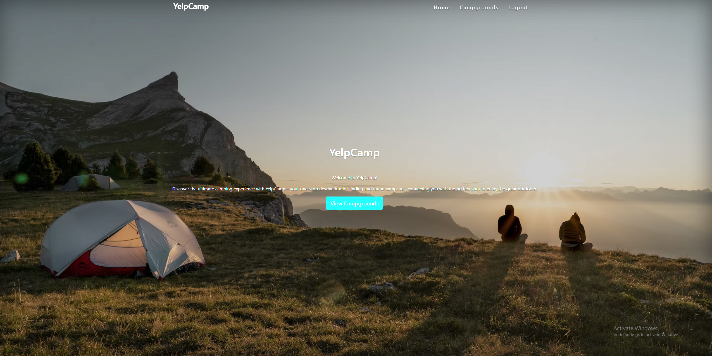

<!-- Improved compatibility of back to top link: See: https://github.com/othneildrew/Best-README-Template/pull/73 -->

<!-- PROJECT LOGO -->
 

  <h1 align="center">YelpCamp</h1>

<!-- ABOUT THE PROJECT -->
## About The Project

YelpCamp is an application where users can create profiles and upload their favourite campsites for others to see. Users can view the campground posts of others and write reviews for them. It also features an interactive cluster map using geolocation to track campgrounds' locations.

### Built With

* [![Node][Node.js]][Node-url]
* [![Express][Express.js]][Express-url]
* [![MongoDB][MongoDB]][Mongo-url]
* [![Bootstrap][Bootstrap.com]][Bootstrap-url]
* [![Passport][Passport.js]][Passport-url]

Live Project: [https://yelp-camp-s180.onrender.com](https://yelp-camp-s180.onrender.com)

<!-- MARKDOWN LINKS & IMAGES -->
<!-- https://www.markdownguide.org/basic-syntax/#reference-style-links -->
[contributors-shield]: https://img.shields.io/github/contributors/github_username/repo_name.svg?style=for-the-badge
[contributors-url]: https://github.com/github_username/repo_name/graphs/contributors
[forks-shield]: https://img.shields.io/github/forks/github_username/repo_name.svg?style=for-the-badge
[forks-url]: https://github.com/github_username/repo_name/network/members
[stars-shield]: https://img.shields.io/github/stars/github_username/repo_name.svg?style=for-the-badge
[stars-url]: https://github.com/github_username/repo_name/stargazers
[issues-shield]: https://img.shields.io/github/issues/github_username/repo_name.svg?style=for-the-badge
[issues-url]: https://github.com/github_username/repo_name/issues
[license-shield]: https://img.shields.io/github/license/github_username/repo_name.svg?style=for-the-badge
[license-url]: https://github.com/github_username/repo_name/blob/master/LICENSE.txt
[linkedin-shield]: https://img.shields.io/badge/-LinkedIn-black.svg?style=for-the-badge&logo=linkedin&colorB=555
[linkedin-url]: https://linkedin.com/in/linkedin_username
[product-screenshot]: images/screenshot.png
[Node.js]: https://img.shields.io/badge/Node.js-35495E?style=for-the-badge&logo=nodedotjs
[Node-url]: https://nodejs.org/en/
[Express.js]: https://img.shields.io/badge/Express-grey?style=for-the-badge&logo=express
[Express-url]: https://expressjs.com/
[MongoDB]: https://img.shields.io/badge/MongoDB-green?style=for-the-badge&logo=mongodb
[Mongo-url]: https://www.mongodb.com/
[Bootstrap.com]: https://img.shields.io/badge/Bootstrap-563D7C?style=for-the-badge&logo=bootstrap&logoColor=white
[Bootstrap-url]: https://getbootstrap.com
[Passport.js]:https://img.shields.io/badge/Passport-white?style=for-the-badge&logo=passport
[Passport-url]: https://www.passportjs.org/
